# 搬瓦工The Plan套餐香港HK85机房实测：移动用户的15ms延迟体验

---

去年搬瓦工推出了一个限量版套餐叫The Plan，年付99.99美元。看起来价格不算便宜，但配置和可选机房都挺有意思的。最大的卖点是可以在18个机房之间随意迁移，包括香港CMI、DC6 CN2 GIA、DC9 CN2 GIA、日本软银这些热门线路。

这次我测的是香港HK85机房（就是Hong Kong CMI那个），测试时间选在北京时间晚高峰——毕竟这个时间段才能看出真实水平。下面就聊聊这个套餐在实际使用中表现怎么样。

---

## 基础配置：中规中矩但够用

先说硬件表现。从融合怪和yabs的测试结果来看，CPU性能、硬盘IO、内存读写这些指标都算正常水平，没有特别突出也没有明显短板。如果你是用来建个站或者跑些日常服务，完全没问题。

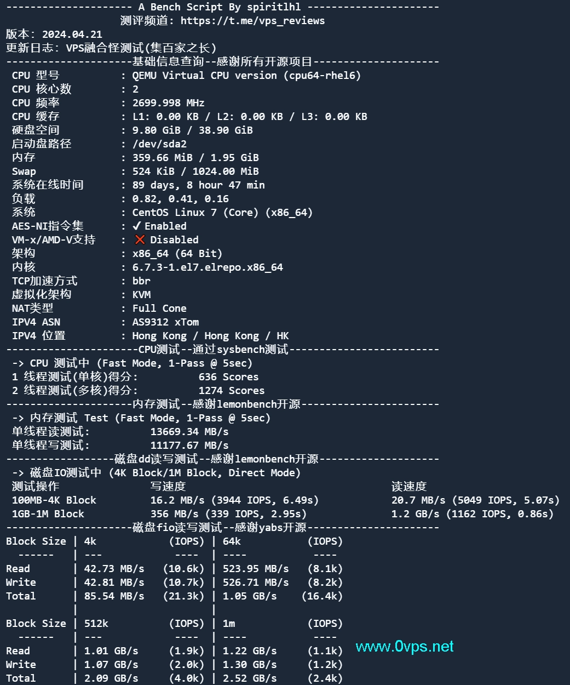

硬盘读写速度在yabs测试中表现稳定，基本能满足大部分应用场景的需求。

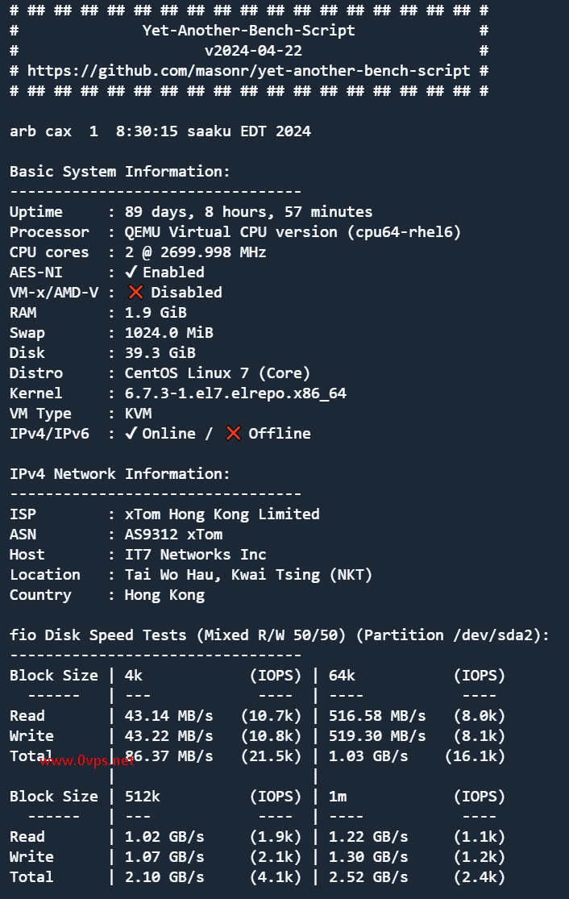

## 网络速度：三网表现有差异

速度测试这块，三网的表现确实不太一样。从HyperSpeed的三网测速结果看，不同运营商的用户体验会有明显区别。

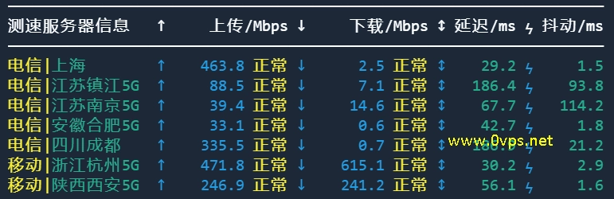

国内各节点的下载速度测试显示，移动用户普遍能跑满带宽，电信和联通则要看具体地区。

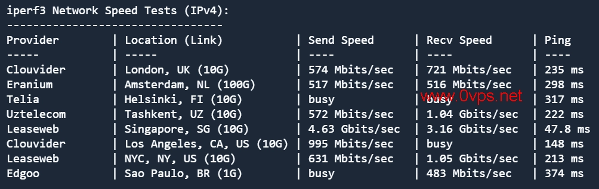

## 延迟和丢包：移动用户真香

重点来了——这个机房对移动用户是真的友好。从ping.pe和itdog的测试数据看，移动线路的丢包率基本保持在0%，延迟方面广州移动只有15ms，这个数字基本秒杀绝大多数海外线路了。

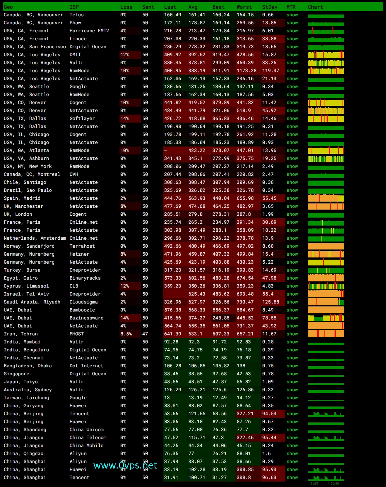

电信和联通的表现就比较分化。👉 [想体验稳定的香港CMI线路？点这里了解搬瓦工The Plan套餐详情](https://bandwagonhost.com/aff.php?aff=79616)，三网ping值大多在10-80ms之间，但电信和联通在部分地区会出现超过1%的丢包，个别节点甚至超过10%。这主要是线路本身的问题，不是机器的锅。

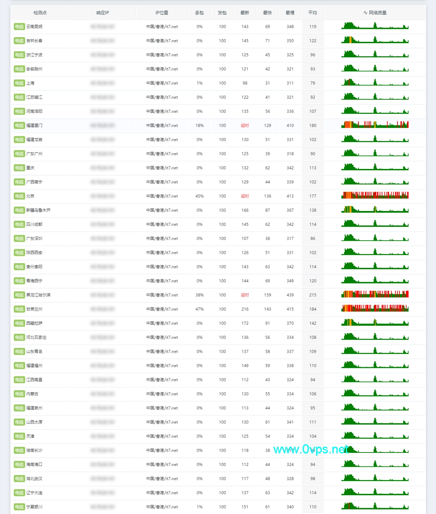

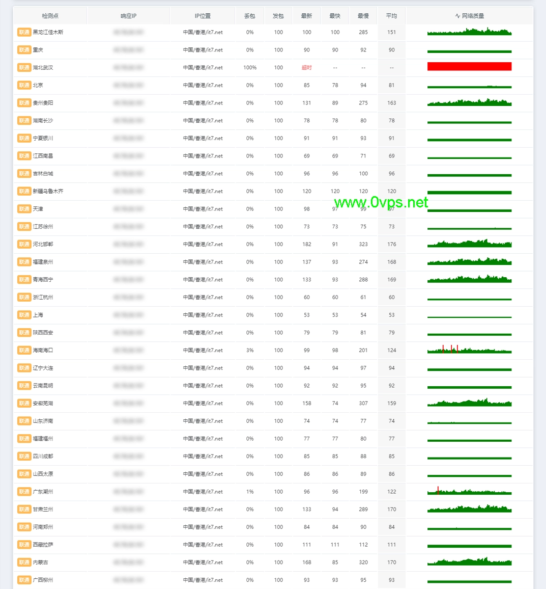

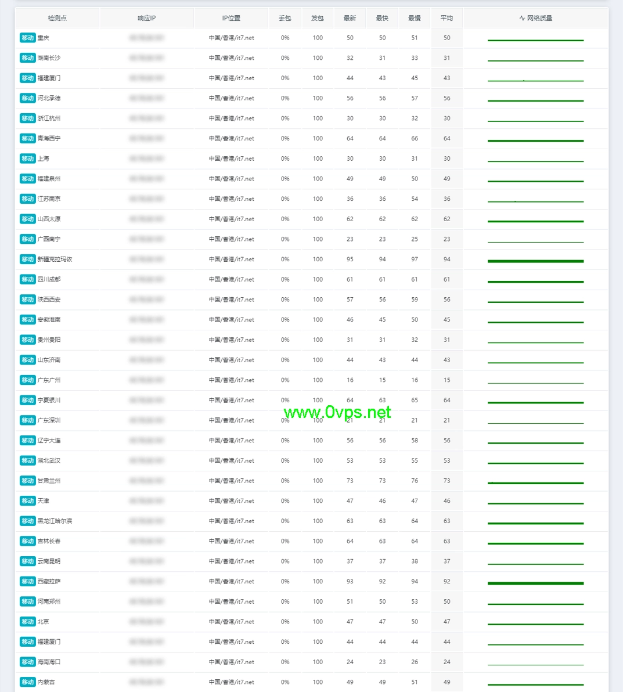

## 路由线路：各有各的走法

去程路由方面，三网走的线路不太一样。电信去程是CN2线路，这个还不错；联通和移动则是各自的常规线路。

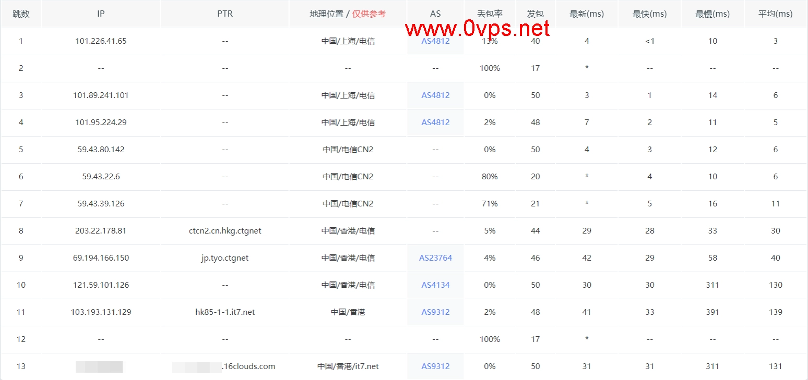

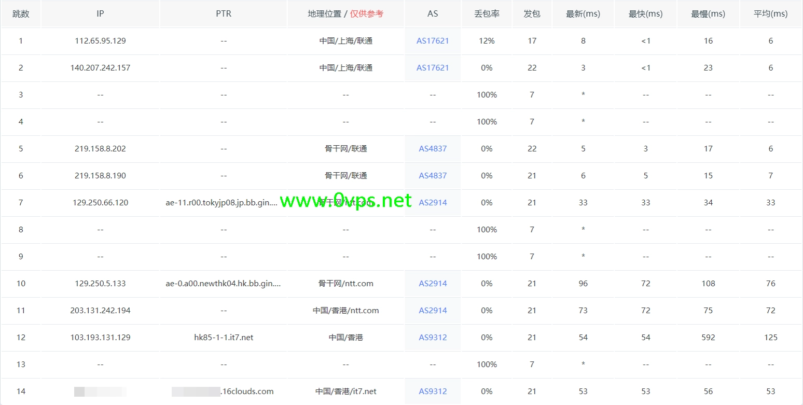

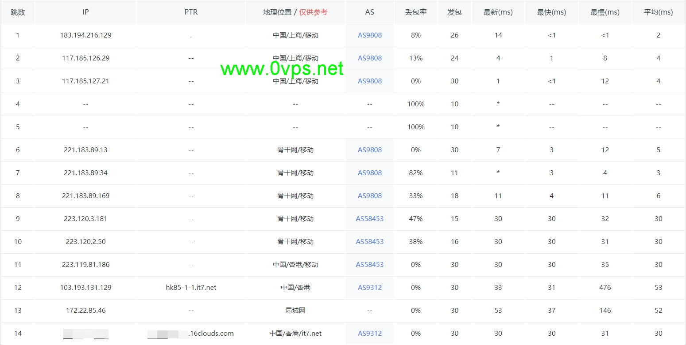

回程就比较统一了——三网都走移动CMI线路。这也解释了为什么移动用户的体验特别好，因为去回程都是走的移动自家的优质线路。

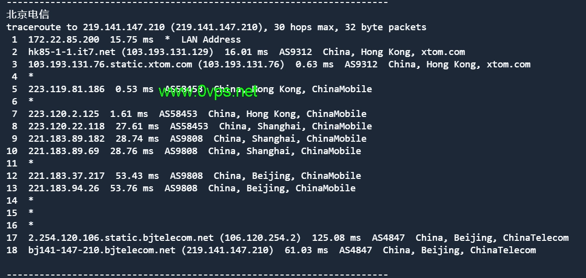

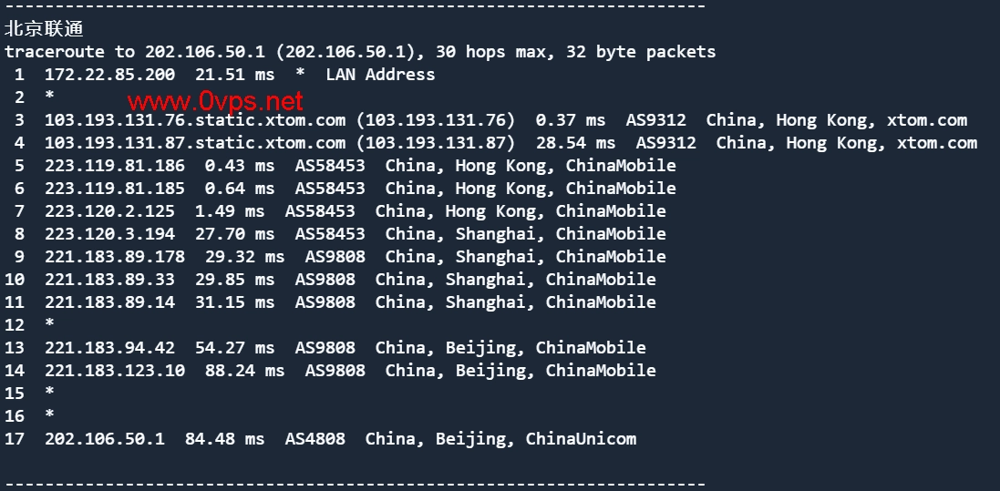

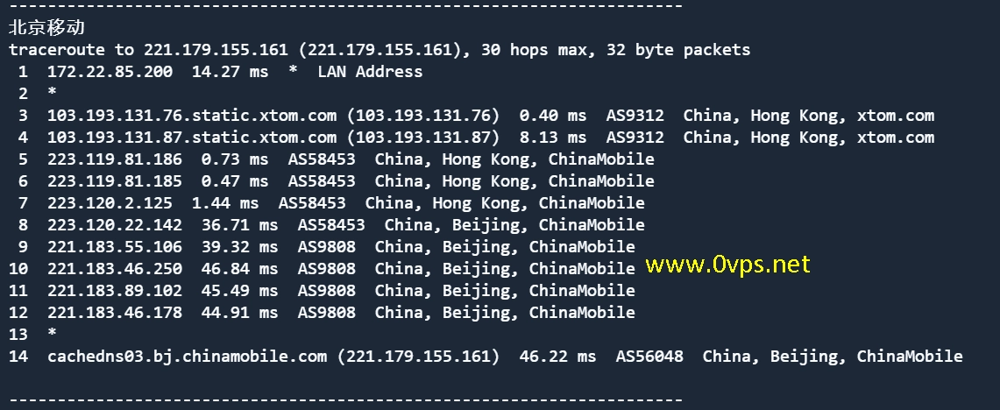

## 流媒体解锁：基本能用

流媒体解锁测试显示，常见的几个平台基本都能正常访问，这对于有观看需求的用户来说算个加分项。

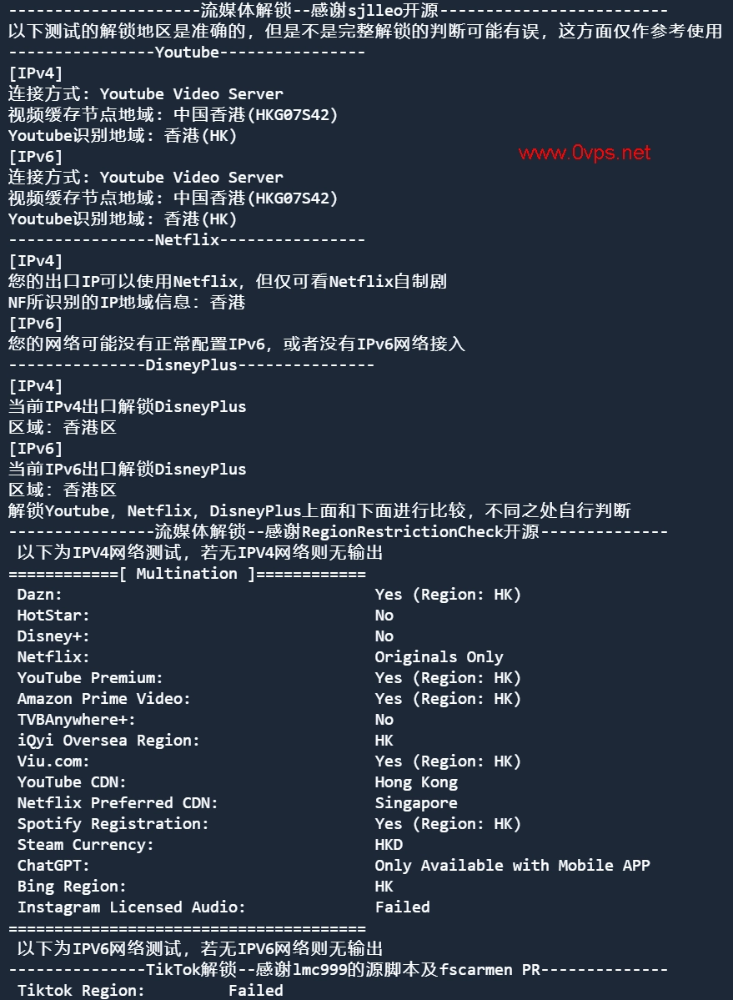

IP质量检测方面，欺诈分数和IP信誉度都在正常范围内，不用担心被各种服务拉黑。

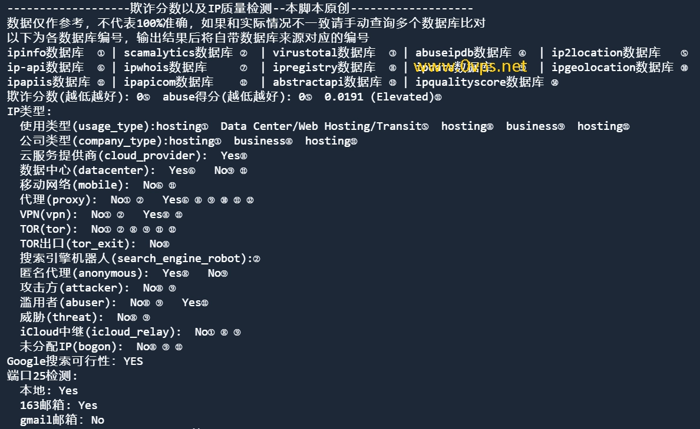

---

## 总结：选对运营商很重要

测下来的感觉就是，The Plan这个套餐在香港HK85机房的表现确实对移动用户最友好——0丢包、15ms延迟、稳定性高，这三个指标基本是无可挑剔。如果你是移动宽带用户，这个套餐可以说是相当合适的选择。

电信和联通用户也能用，但体验就要打个折扣了。部分地区可能会遇到丢包问题，需要根据自己所在地的实际情况判断。好在The Plan可以在18个机房之间自由切换，如果香港CMI不够理想，还能试试其他线路。

最后说一句，年付99.99美元的价格在同类配置里算是中等偏上，👉 [但考虑到可选机房的灵活性和CN2 GIA线路的加持，搬瓦工The Plan套餐的性价比还是挺不错的](https://bandwagonhost.com/aff.php?aff=79616)。如果你正好是移动用户，又需要一个稳定的香港VPS，这个套餐值得考虑。
